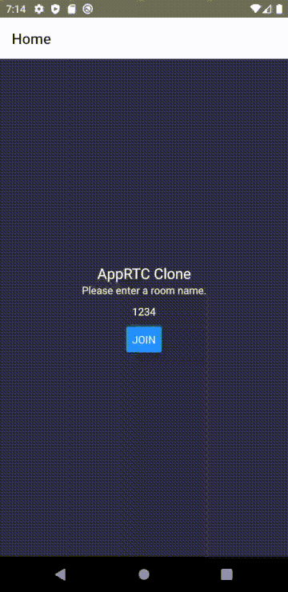

# ReactNativeAppRTC

A simplified version of [AppRTC](https://appr.tc/) created using React Native.
The app uses WebRTC to offer a video chat functionality.
The visual design is derived from [react-native-webrtc-sample](https://github.com/colinwitkamp/react-native-webrtc-sample), and the internal architecture is heavily influenced by the one in [Learning WebRTC](https://www.packtpub.com/product/learning-webrtc/9781783983667) by Dan Ristic.

React Native is used to create the app, so it should run both on iOS and Android (though I tested it only on my Android device and an emulator).



## How to run the app

Run the signaling server for the app:

```bash
$ git clone git@github.com:morinokami/ReactNativeAppRTC.git
$ cd ReactNativeAppRTC/src
$ node server.js
...
```

Open another terminal and change the value of `host` in `src/components/WebRTC.js` so that it points to the signaling server.
Lastly, run `npm start` and `npm run android`.
